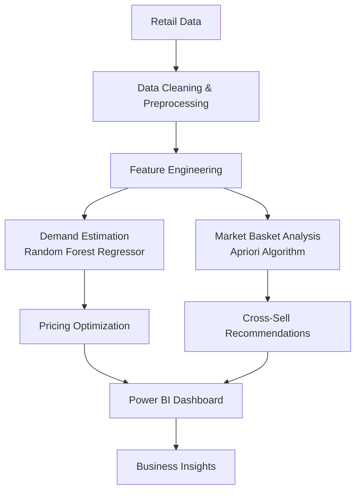
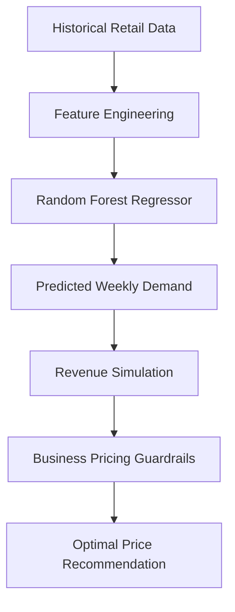
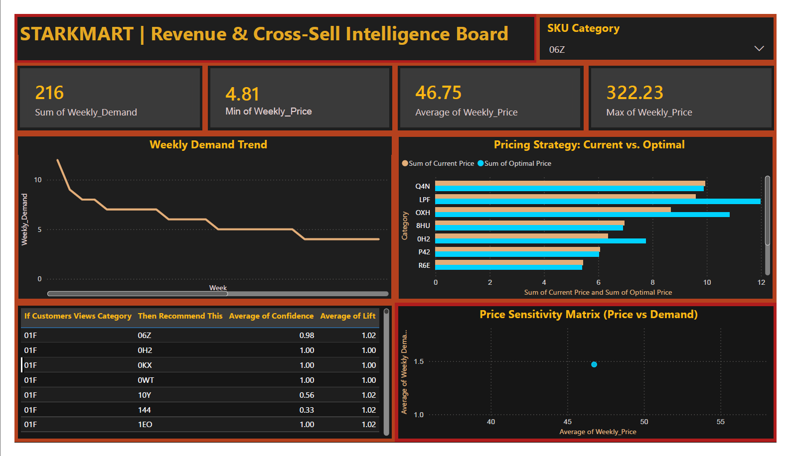

# StarkMart – Retail Pricing Optimization & Cross-Sell Intelligence


## Table of Contents

- Project Overview
- Business Problem
- Solution Architecture
- Dataset
- Workflow
- Exploratory Data Analysis
- Machine Learning
- Market Basket Analysis
- Power BI Dashboard
- Results & Insights
- Repository Structure
- Tech Stack
- Limitations
- Future Improvements
- How to Run
- Author


## Project Overview

StarkMart is an end-to-end retail analytics project that combines machine learning, market basket analysis, and business intelligence to support data-driven retail decision-making.

The project forecasts weekly product demand, simulates revenue-aware pricing recommendations, identifies cross-selling opportunities using Association Rule Mining, and presents the analytical outputs through an interactive Power BI dashboard.


## Project Objectives

The primary objectives of this project are to:

- Forecast weekly product demand using historical pricing data.
- Analyze the relationship between product prices and customer demand.
- Simulate revenue-aware pricing recommendations within practical business constraints.
- Discover frequently co-purchased product categories using Association Rule Mining.
- Generate cross-selling recommendations from historical transaction patterns.
- Present analytical insights through an interactive Power BI dashboard.


## Solution Architecture

The project follows a sequential analytics pipeline that transforms raw retail transaction data into actionable business insights.

Historical retail data is first cleaned and enriched through feature engineering. A Random Forest Regression model is then used to estimate product demand, while business-defined pricing guardrails are applied to simulate revenue-aware pricing recommendations. In parallel, Association Rule Mining identifies frequently purchased product combinations to generate cross-selling recommendations.

Finally, the outputs from both analytical pipelines are integrated into an interactive Power BI dashboard for business exploration and decision support.




## Dataset

The project uses historical retail data containing weekly demand, product prices, product categories, and transactional purchase records.

The pricing dataset supports demand forecasting and pricing analysis, while the transactional dataset is transformed into market baskets for Association Rule Mining. Both datasets undergo preprocessing and feature engineering before being used for machine learning, recommendation generation, and business intelligence reporting.


## Project Workflow

The project is organized into five major stages:

1. Data preprocessing and exploratory analysis.
2. Feature engineering for pricing and demand analysis.
3. Demand forecasting using Random Forest Regression.
4. Cross-selling analysis using Association Rule Mining.
5. Business intelligence reporting through an interactive Power BI dashboard.


## Exploratory Data Analysis

Exploratory Data Analysis (EDA) was performed to understand pricing behavior, demand distribution, and product-level trends before model development.

The analysis included:

- Examining demand and pricing distributions.
- Identifying missing values and inconsistencies.
- Studying weekly demand trends.
- Comparing pricing patterns across product categories.
- Exploring relationships between price and demand through visualizations.

These insights guided feature engineering and helped validate the assumptions used during model development.


## Feature Engineering

To improve the analytical workflow, additional features were derived from the historical pricing data.

Engineered features include:

- Historical minimum, average, and maximum prices.
- Week-over-week price changes.
- Rolling demand trends.
- Pricing boundaries used as business guardrails during optimization.

These features provided additional context for demand prediction and pricing simulations.


## Machine Learning

### Demand Forecasting

A Random Forest Regressor was trained to estimate weekly product demand based on historical pricing information and engineered features.

Random Forest was selected because it effectively models complex, non-linear relationships without requiring extensive feature scaling or distributional assumptions.

The predicted demand values form the foundation for the project's pricing simulations.

### Pricing Optimization

Predicted demand values were combined with pricing simulations to estimate potential revenue across different price points.

Since tree-based models cannot reliably extrapolate beyond the historical pricing range, business-defined pricing guardrails were incorporated to constrain the simulated recommendations within practical limits.

The resulting optimal prices represent revenue-aware recommendations rather than unrestricted mathematical optima.





## Market Basket Analysis

Association Rule Mining was performed using the Apriori algorithm to identify products that are frequently purchased together.

Each discovered rule was evaluated using Support, Confidence, and Lift to measure the strength of product associations. These metrics were used to generate cross-selling recommendations that can assist retail businesses in increasing average order value.

A reusable recommendation function was also developed to return the most relevant cross-selling suggestions for a selected product category.


## Power BI Dashboard



The analytical outputs from the machine learning and market basket analysis pipelines are consolidated into an interactive Power BI dashboard designed for business users.

The dashboard provides a centralized view of pricing performance, demand trends, and cross-selling insights, enabling stakeholders to explore key metrics and make informed pricing decisions through an intuitive interface.

### Dashboard Highlights

- **Category Filter:** Dynamically filters all visuals by product category.
- **Key Performance Indicators (KPIs):** Displays total demand along with historical minimum, average, and maximum prices.
- **Demand Trend Analysis:** Tracks weekly demand patterns across the selected category.
- **Pricing Comparison:** Compares historical selling prices with ML-recommended prices.
- **Cross-Sell Insights:** Displays product associations with Support, Confidence, and Lift metrics.
- **Price Sensitivity Visualization:** Illustrates the relationship between product price and demand.


## Results & Insights

The project demonstrates how machine learning and retail analytics can be combined to support practical business decisions.

Key outcomes include:

- Successfully forecasted weekly demand using a Random Forest Regression model.
- Generated revenue-aware pricing recommendations within historical pricing boundaries.
- Identified strong product associations through Association Rule Mining for cross-selling opportunities.
- Developed a reusable recommendation function capable of suggesting complementary products based on historical purchasing behavior.
- Integrated analytical outputs into an interactive Power BI dashboard for business exploration and decision support.


## Repository Structure

```text
StarkMart-Retail-Analytics/
│
├── data/
│   ├── raw_data.csv
│   ├── cleaned_dataset.csv
│   ├── starkmart_pricing_optimization.csv
│   └── starkmart_recommendation_rules.csv
│
├── notebooks/
│   └── starkmart_retail_analytics.ipynb
│
├── dashboard/
│   └── StarkMart.pbix
│
├── models/
│   ├── pricing_model_0H2.pkl
│   ├── pricing_model_8HU.pkl
│   ├── pricing_model_IEV.pkl
│   ├── pricing_model_LPF.pkl
│   ├── pricing_model_N8U.pkl
│   ├── pricing_model_OXH.pkl
│   ├── pricing_model_P42.pkl
│   ├── pricing_model_Q4N.pkl
│   ├── pricing_model_R6E.pkl
│   ├── pricing_model_U5F.pkl
│
├── images/
│   ├── dashboard_06z.png
│   ├── dashboard_01f.png
│   ├── dashboard_all.png
│   ├── correlation_matrix.png
│   ├── price_elasticity and demand.png
│   ├── price_variance.png
│   ├── top_10_product_category.png
│
├── README.md
└── requirements.txt
```

## Tech Stack

| Category | Technologies |
|----------|--------------|
| Programming Language | Python |
| Data Analysis | Pandas, NumPy |
| Machine Learning | Scikit-learn (Random Forest Regressor) |
| Association Rule Mining | Mlxtend (Apriori, Association Rules) |
| Data Visualization | Matplotlib |
| Business Intelligence | Power BI |
| Development Environment | Jupyter Notebook |
| Version Control | Git, GitHub |


## Limitations

While the project demonstrates a complete retail analytics workflow, it has several practical limitations:

- The pricing recommendations are generated using historical data and may not generalize to market conditions outside the observed pricing range.
- External factors such as promotions, competitor pricing, seasonality, holidays, and inventory constraints are not considered during demand forecasting.
- The recommendation engine is based on Association Rule Mining and does not provide personalized recommendations for individual customers.
- Pricing optimization is performed through simulation within business-defined pricing guardrails rather than real-world experimentation.
- The project is intended as a proof-of-concept analytics solution and has not been deployed in a production environment.


## Future Improvements

Possible enhancements for future versions of the project include:

- Incorporating external business variables such as promotions, holidays, and competitor pricing into demand forecasting.
- Evaluating additional machine learning models such as XGBoost or LightGBM for improved predictive performance.
- Developing personalized recommendation systems using customer-level purchase histories.
- Deploying the recommendation engine as a REST API for real-time retail applications.
- Automating data ingestion and dashboard refresh through an end-to-end data pipeline.


## How to Run

### 1. Clone the repository

```bash
git clone https://github.com/KritheeshB/StarkMart-Retail-Analytics.git
```

### 2. Navigate to the project directory

```bash
cd StarkMart
```

### 3. Install the required dependencies

```bash
pip install -r requirements.txt
```

### 4. Launch Jupyter Notebook

```bash
jupyter notebook
```

### 5. Open the notebook

Run the notebook sequentially to reproduce the data preprocessing, exploratory data analysis, demand forecasting, pricing optimization, and market basket analysis workflow.

### 6. Explore the dashboard

Open the `StarkMart.pbix` file using **Power BI Desktop** to interact with the dashboard.


## Author

**Kritheesh B**

Production Engineering Undergraduate  
National Institute of Technology Tiruchirappalli

GitHub: https://github.com/KritheeshB

LinkedIn: *https://www.linkedin.com/in/kritheesh-b-a17390332/*

